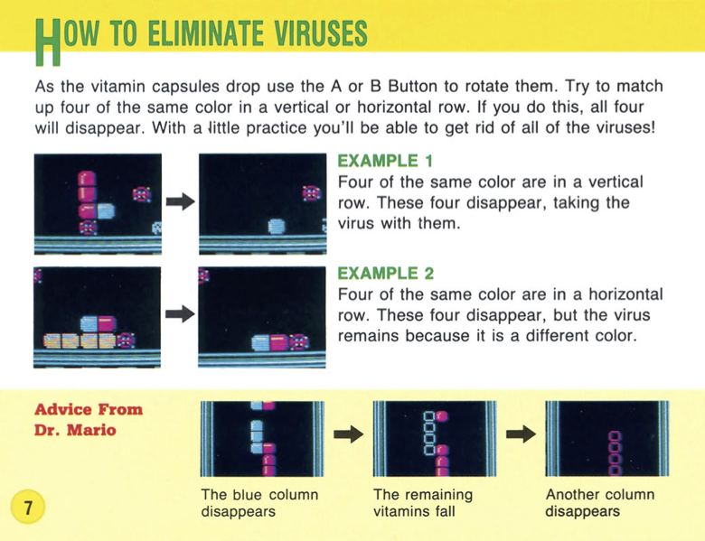

# Dr-Mario
### This is a clone I made of the SNES game 'Dr Mario' made by Nintendo in 1990. I was able to build this modest clone with HTML, CSS, and Javascript as well as help from Webpack and the keymaster.js library.

## Gameplay

### The objective of the game is to rid the screen of viruses. The player does so by matching colored pills with the virus to form 4 

  
  

